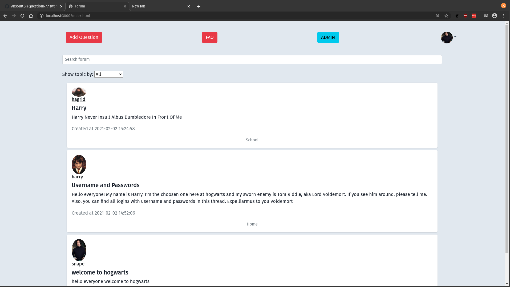
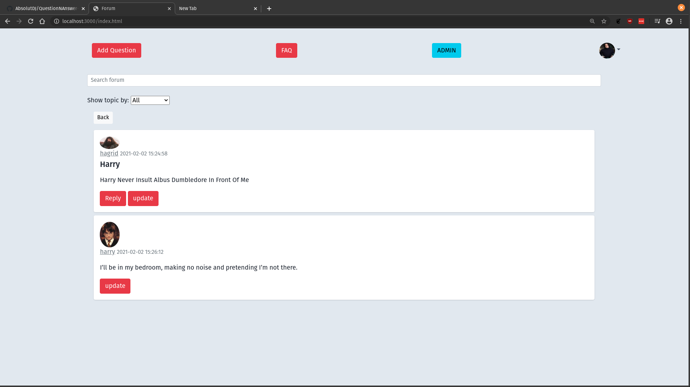
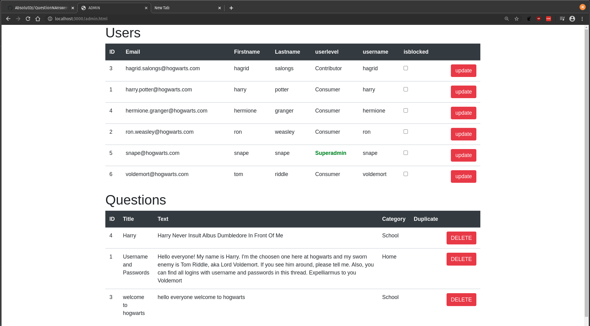

# QuestionNAnswer-Forum-

To run the Q&A engine:

1. Download the zipped version or git clone into desired folder.
2. Install the node modules via npm install all in the terminal.
3. Run the code with npm run serve.

Enjoy

# About
  Our first time working with **node.js** and **vue.js** as a school project. The project idea was to make a forum with focus on the backend and create a working API with  endpoints from our database. 
  Time distribution:\
    30% - Frontend\
    70% - Backend

# Tech/Framework used
Languages + packages:
1. JavaScript
  - Node.js
  - Vue.js
  - Express-session

2. HTML5/CSS3
  - Bootstrap
  

# Preview
  
  
  
   
    
  

 

